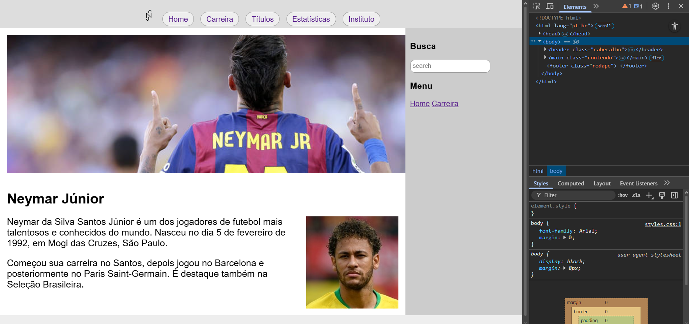
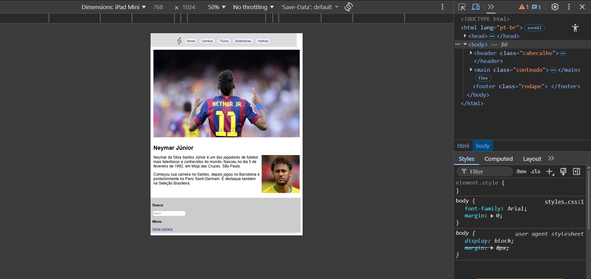
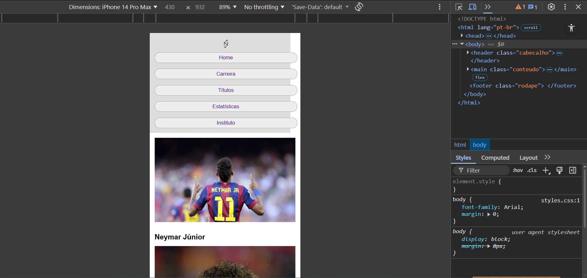

# Trabalho Prático - Semana 5

Dessa vez, vamos dar sequência ao projeto iniciado na semana passada. Se você ainda não fez o projeto da semana anterior, fique atento, se programe e procure colocar as atividades em dia. Volte lá, leia tudo e faça sua parte pois essa atividade depende da atividade anterior..

Nessa atividade,vamos evoluir o projeto para que a home-page funcione bem tanto no celular quanto no desktop, entendendo também como é o processo gradativo e colaborativo de desenvolvimento de um software, registrando cada etapa no histórico de commits do repositório do git/GitHub.

**IMPORTANTE:** Você deve trabalhar e alterar apenas arquivos dentro da pasta **`public`,** mantendo os arquivos **`index.html`** e **`styles.css`** com estes nomes. Deixe todos os demais arquivos e pastas desse repositório inalterados. **PRESTE MUITA ATENÇÃO NISSO.**

## Informações Gerais

- Nome: Vinicius Eduardo de Souza Matos Silva
- Matricula: 911693
- Proposta de projeto escolhida: 1. Pessoas e Produções
- Breve descrição sobre seu projeto: O meu projeto consiste em um site que mostra a carreira esportiva do Neymar Jr., onde nele terá informações de sua carreira, como clubes que passou, títulos e estatísticas, mas também mostrar uma coisa que ele faz fora de campo, o seu instituto, que tem o intuito de ajudarem famílias com má condição.

## Print da versão responsiva com CSS puro [DESKTOP]

<<  COLOQUE A IMAGEM AQUI >>

## Print da versão responsiva com CSS puro [MOBILE] (*)

<<  COLOQUE A IMAGEM AQUI >>
Tablet: 

Celular:

(*) Utilize as ferramentas do desenvolvedor do seu navegador para colocar no modo reponsivo, escolha um celular qualquer e recarregue a página antes de tirar o print. 
